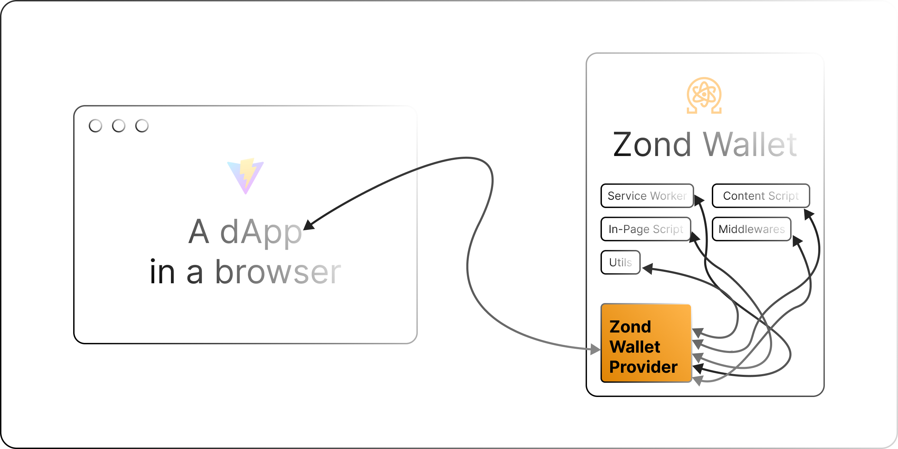

# QRL Wallet Provider

The Ethereum-style provider object announced by the [QRL Web3 Wallet](https://github.com/theQRL/qrl-web3-wallet), based on EIP-6963. This facilitates the connection and communication between the QRL wallet extension and dApps.

> **Important!** QRL Wallet Provider is derived from MetaMask repositories ([`json-rpc-engine`](https://github.com/MetaMask/json-rpc-engine), [`json-rpc-middleware-stream`](https://github.com/MetaMask/json-rpc-middleware-stream), [`object-multiplex`](https://github.com/MetaMask/object-multiplex), [`post-message-stream`](https://github.com/MetaMask/post-message-stream), [`providers`](https://github.com/MetaMask/providers), [`rpc-errors`](https://github.com/MetaMask/rpc-errors), [`safe-event-emitter`](https://github.com/MetaMask/safe-event-emitter), [`superstruct`](https://github.com/MetaMask/superstruct), [`utils`](https://github.com/MetaMask/utils)). Each sub-module's original license is preserved alongside the code under `src/<module>/LICENSE`.

## :keyboard: Usage

- Run `npm i -D @theqrl/qrl-wallet-provider` in your project to install the package.
- Import the required functions and invoke them from your in-page script.

```Javascript
import { initializeProvider, WindowPostMessageStream } from "@theqrl/qrl-wallet-provider";

const initializeInPageScript = () => {
  try {
    const qrlStream = new WindowPostMessageStream({
      name: QRL_POST_MESSAGE_STREAM.INPAGE,
      target: QRL_POST_MESSAGE_STREAM.CONTENT_SCRIPT,
    });

    initializeProvider({
      connectionStream: qrlStream,
      logger: log,
      providerInfo: {
        uuid: uuid(),
        name: QRL_WALLET_PROVIDER_INFO.NAME,
        icon: QRL_WALLET_PROVIDER_INFO.ICON,
        rdns: QRL_WALLET_PROVIDER_INFO.RDNS,
      },
    });
  } catch (error) {
    console.warn("QRL Wallet: Failed to initialize the QRL wallet provider", error);
  }
};

// This function announces the QRL wallet provider (EIP-6963) so dApps can detect it.
initializeInPageScript();
```

## License

MIT — see [`LICENSE`](./LICENSE). The MetaMask-derived sub-modules retain their original licenses under `src/<module>/LICENSE`.

## Security

See [`SECURITY.md`](./SECURITY.md). Report vulnerabilities to **security@theqrl.org**.
